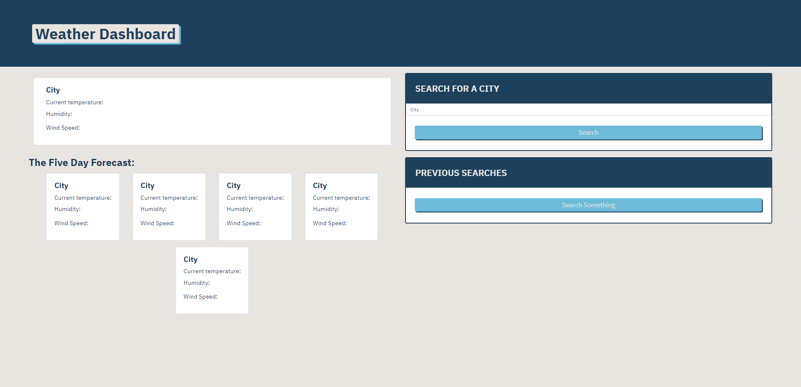
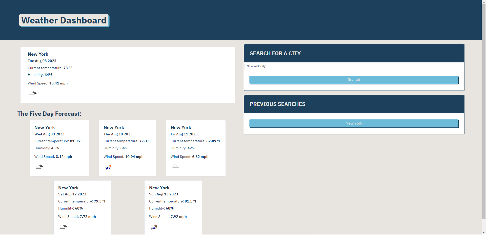
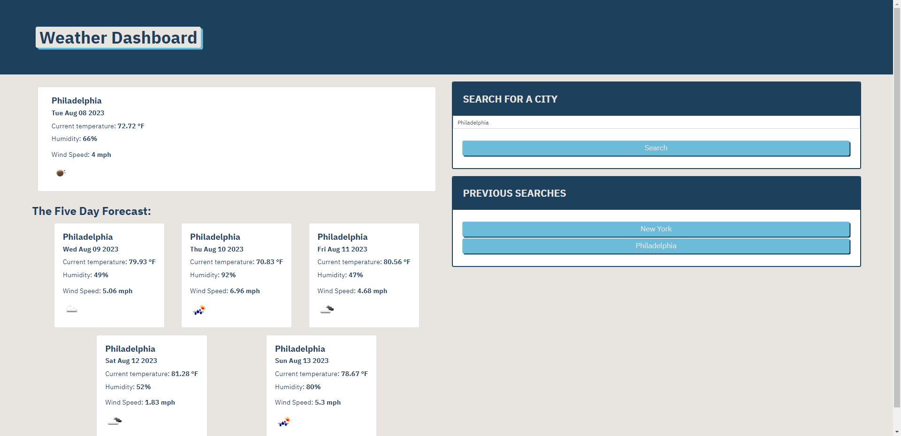
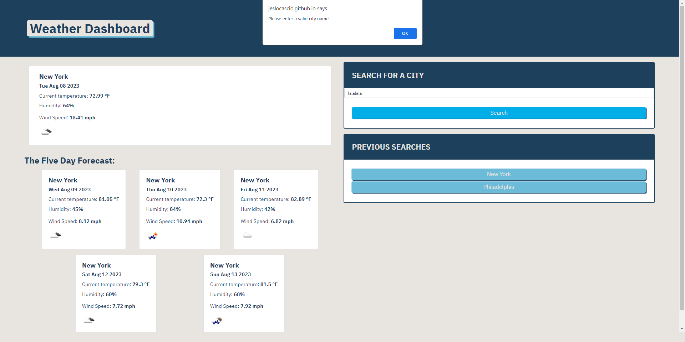

# Weather_Dashboard
## Description

When creating this project, I set out to create a Weather Dashboard that can accurately give you the current and future weather conditions of anywhere you want to search. By completing this assignment, I gained a better understanding of fetch functions and APIs.

## Installation

N/A

## Usage

You can access the website here: https://jeslocascio.github.io/Weather_Dashboard/

When you open this page, you will be presented with a screen that looks like this:

Upon typing in a city into the search bar, the boxes on screen will fill up with both the current weather forecast (at the top of the screen), and the forecast for the next five days (at the bottom of the screen). In this situation, the site will look like this:

Every time you search a city on the site, the previous searches are added to a "Previous Searches" box, as seen below:

Once the items are stored to the "Previous Searches" bar, you can then return to any previously done searches at any time by clicking the new button, as demonstrated below:

In the event you type in a word or letters that do not exist as a city name, you will get the following alert:

## Credits

Font Awesome

Google Fonts

Bootstrap

JQuery

OpenWeather API

## License

MIT License

Please refer to the LICENSE in the repo for more information.

## Features

5 Day Weather Forecast

Search Bar

Buttons

Previous Search list with generated buttons